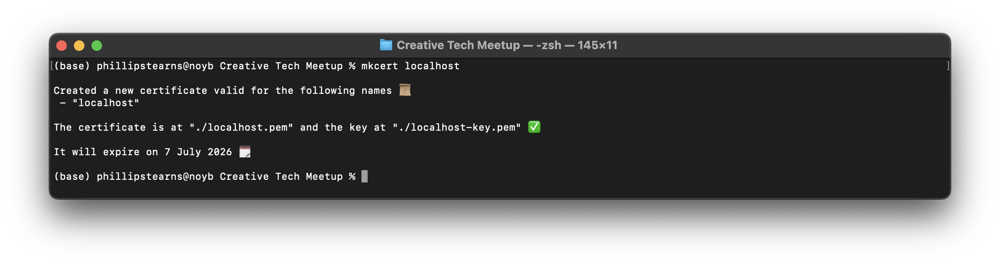
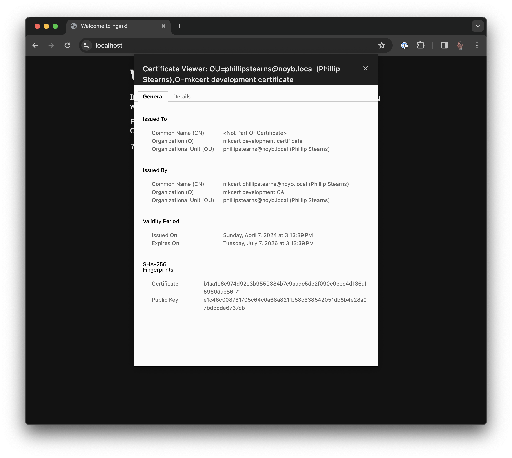

# Setting up HTTPS locally for NGINX on MAC OS

* source: [https://web.dev/articles/how-to-use-local-https](https://web.dev/articles/how-to-use-local-https)

Install `mkcert` and `nss`

1. `brew install mkcert nss`
1. `mkcert -install`
1. Create a folder in which to create the certificates: `mkdir ~/.ssl`
1. Change to that directory: `cd ~/.ssl`
1. Create the certificate `mkcert localhost`



Your certificates should now be at `/Users/<YOUR_USERNAME>/.ssl/localhost.pem` and `/Users/<YOUR_USERNAME>/.ssl/localhost-key.pem`

## Add the certificates to NGINX config

1. Open `/opt/homebrew/etc/nginx/nginx.conf`
1. Find the `HTTPS server` block 
1. Uncomment and add the path to your certificates set above:


```
# HTTPS server
#
server {
	listen       443 ssl;
	server_name  localhost;

	ssl_certificate      /Users/<YOUR_USERNAME>/.ssl/localhost.pem;
	ssl_certificate_key  /Users/<YOUR_USERNAME>/.ssl/localhost-key.pem;

	ssl_session_cache    shared:SSL:1m;
	ssl_session_timeout  5m;

	ssl_ciphers  HIGH:!aNULL:!MD5;
	ssl_prefer_server_ciphers  on;
	
	location / {
		root   html;
		index  index.html index.htm;
	}
}
```

1. Save the changes
1. Restart the server `brew services restart nginx`
1. Navigate to `https://localhost`

Success!



## Redirect from HTTP to HTTPS

1. Open `/opt/homebrew/etc/nginx/nginx.conf`
1. Add the following server block inside the html block:


```
server {
    listen 80 default_server;
    server_name _;
    return 301 https://$host$request_uri;
}
```

1. Save changes
1. Restart the server `brew services restart nginx`
1. Navigate to `http://localhost:80`

Doing so will force the browser to attempt to connect to the HTTP version of your site. The NGINX configuration listens on port 80 and redirects the browser to the HTTPS version of the site (on port 443).