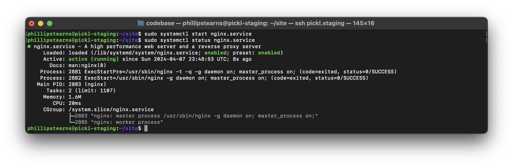
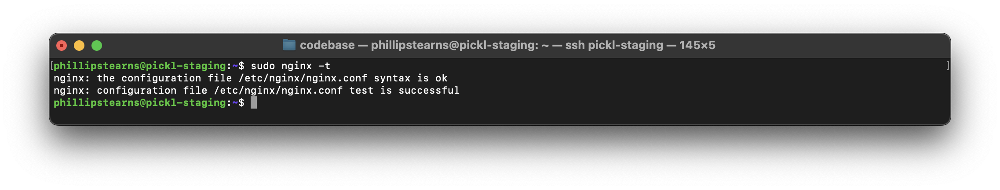
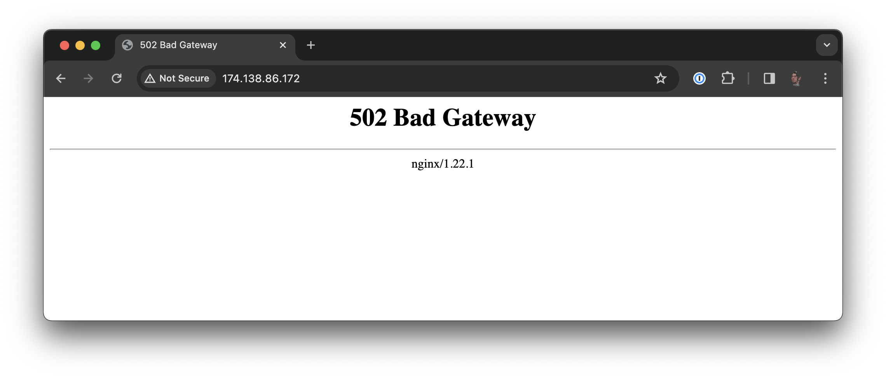
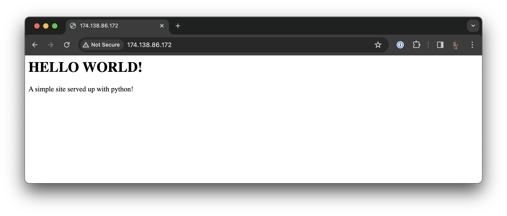
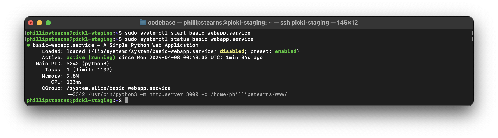
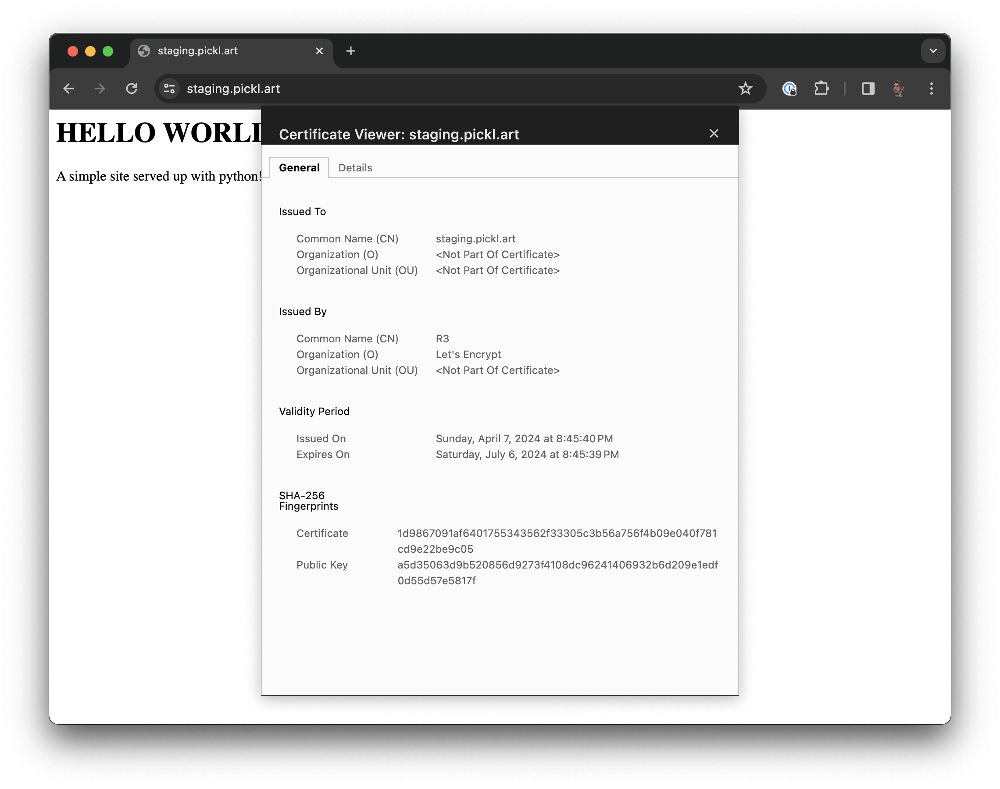

# Setting Up NGINX on a Debian Linux Server for Web Application Deployment with TLS

Deploying a web application without a paid service may not be for everyone, but what you might gain is a greater understanding of how such services operate under the hood. Another benefit to doing things this way is potential cost savings, flexibility of configuration as well as the ability to use a single VPS for a handful of different lightweight tasks.

1. Purchase a VPS (\$)
1. Register a Domain (\$)
1. Configure the DNS settings for the Domain to point to the IP Address of your VPS
1. Install and configure NGINX
1. Build and deploy your web application

## Purchase a Virtual Private Server (VPS)

There are lots of different data centers or service providers you can use to setup a Virtual Private Server (VPS). I don't know of any that are free. I've used HostSailor, HostUS, VirMach, Digital Ocean, and several others. It's beyond to scope of this workshop to cover selecting a VPS host.

For demonstration purposes, I've setup a droplet on Digital Ocean running the latest version of Debian Linux (12).

Some items you'll need to set up on your own:

* Access your VPS via `ssh`
* [Create a non-root user](https://linuxize.com/post/how-to-create-users-in-linux-using-the-useradd-command/) with [sudo privileges](https://linuxize.com/post/how-to-add-user-to-group-in-linux/) [(passwordless)](https://linuxize.com/post/how-to-run-sudo-command-without-password/) and [`ssh` publickey access](https://linuxize.com/post/how-to-set-up-ssh-keys-on-debian-10/).
* Write down the IP Address of your VPS.

## Purchase a Domain

If you're going to publish your web application publicly, you're going to want to purchase a domain. TLS certificates used for HTTPS are bound to domain names and not IP Addresses. It's possible to create self-signed certificates for IP Addresses, but anyone other than you will see a warning in their browser that the site is insecure.

To properly setup TLS you need to own a domain name. There are a number of different hosts you can purchase a domain name from. It's beyond the scope of this workshop to dig into considerations. The big one is this:

* Your domain hosting service should allow for DNS configuration

## Mapping your VPS to a Domain

Configuring your DNS settings for your domain allow you to direct requests to your top-level domain and any subdomains to different IP Addresses (servers or services). To setup email signing etc, you can create records here. You can also create records to allow other services and sites to verify that you are the owner of the domain.

For this workshop, we're only concerned with creating A records to point to the IP Address of our VPS.

### Pointing a top level domain to an IP Address (my-domain.com or www.my-domain.com):

1. Create an A record:
	* Host: @
	* Value: \<IP Address of your VPS\>
	* TTL: Automatic

1. Create an A record:
	* Host: www
	* Value: \<IP Address of your VPS\>
	* TTL: Automatic

### Pointing a subdomain to an IP Address (subdomain.my-domain.com):

1. Create an A record:
	* Host: \<your_subdomain\> (e.g. webapp, demo, test, etc.)
	* Value: \<IP Address of your VPS\>
	* TTL: Automatic or 60 minutes

1. Wait a few minutes and then ping the domain: `ping <YOUR.DOMAIN.COM>`
1. Once the DNS records update and your domain points to the IP address of your VPS, you're ready to setup TLS certificates for secure, encrypted connections. 

## Setting up NGINX

1. Install
1. Configure a Reverse Proxy

### Installation on Debian 12

1. Install `nginx`: `sudo apt-get update && sudo apt-get install nginx`
1. Enable the service to start at boot: `sudo systemctl enable nginx.service`
1. Make sure `nginx` is stopped: `sudo nginx -s stop`
1. Start the `nginx.service`: `sudo systemctl start nginx.service`
1. Check the status of the service: `sudo systemctl status nginx.service`



### Configuring A Basic Reverse Proxy with NGINX

Whether you're running multiple smaller applications or a larger microservice-oriented application, NGINX can be configured as a reverse proxy to aid in load balancing, caching, encryption, and increased protection from attacks.

For demonstration purposes, we'll set up a reverse proxy pointing to the simplest possible python web application at `http://0.0.0.0:3000`.

The configuration files for Debian Linux installations of NGINX are different from that of a Homebrew installation on MacOS. Configuration files on my VPS are located in `/etc/nginx/`. Notice that in `/etc/nginx/nginx.conf` there aren't any server blocks. Instead, there is a line `include /etc/nginx/sites-enabled/*;`.

This `include` directive tells NGINX to load configuration files located in the `/etc/nginx/sites-enabled/` directory. If we look inside, we see `/etc/nginx/sites-enabled/default`. This is where the default server configuration blocks are. For simplicity sake, we'll just edit this file.

1. `sudo nano /etc/nginx/sites-enabled/default`
1. Find the `location /` block and modify it:

```
location / {
	
	proxy_pass http://0.0.0.0:3000;
	
	# First attempt to serve request as file, then
	# as directory, then fall back to displaying a 404.
	try_files $uri $uri/ =404;
}
```

The line `proxy_pass http://0.0.0.0:3000;` will route traffic to port 3000. This is where we'll set up our simple python application.

1. Save the changes.
1. Run `sudo nginx -t`



1. If successful, run `sudo nginx -s reload` to apply the new configuration.
1. Navigate to `http://<YOUR_SERVER_IP>:80/` and you should see a 502 Bad Gateway page:



This is perfectly fine. What it means is that NGINX has found the route and is directing traffic upstream, but the upstream server is not responding (because we haven't set it up yet!)

## A Simple Python Web Application

There are a number of different web application frameworks in Python. I've grown fond of Tornado. Others that exist are Django, Flask, and FastAPI. Each has their strengths and weaknesses, which of course are beyond the scope of this workshop to cover. You could also use Node.js to build a web application and spin it up at port 3000 as well.

For this example, we're using a python one-liner to launch a simple http server and serve up an index.html file.

### Build the application:

1. `mkdir ~/www`
1. `cd ~/www`
1. `nano index.html`

```
<html>
        <h1>HELLO WORLD!</h1>
        <p>
                A simple site served up with python!
        </p>
</html>
```

1. Press `control+x` then `y` then `return` to save and exit.
1. `python3 -m http.server 3000`
1. Navigate to `http://<YOUR_SERVER_IP>:80/` and you should see the page:



Hooray! You've done it! NGINX is directing traffic to `/` upstream using the proxy_pass directive to the application server running on port 3000.

This may seem like an extra step, but this allows us to setup numerous smaller applications with specific sets of functions on different ports. We can then use NGINX to setup routes using the location blocks to direct requests to their intended services.

### Manage it with Systemd Service

This is great! But as soon as you sign off, your application will go offline because it's attached to the terminal session. To set up your applications to run in the background as service, we need to create and deploy [systemd](https://manpages.debian.org/buster/systemd/systemd.1.en.html) [service units](https://manpages.debian.org/buster/systemd/systemd.service.5.en.html).

#### What is systemd

>System and Service Manager
>
>systemd is a suite of basic building blocks for a Linux system. It provides a system and service manager that runs as PID 1 and starts the rest of the system.

#### What is a systemd service unit

>systemd.service - Service unit configuration
>
>A unit configuration file whose name ends in ".service" encodes information about a process controlled and supervised by systemd.

In short, we'll create a systemd service unit file that will allow us to use systemd to manage/control our web-application as a service.

1. `sudo nano /lib/systemd/system/basic-webapp.service`


```
[Unit]
Description=A Simple Python Web Application
After=nginx.service
Wants=nginx.service

[Service]
Type=simple
ExecStart=/usr/bin/python3 -m http.server 3000 -d '/home/phillipstearns/www/'
TimeoutStopSec=5
KillMode=mixed

[Install]
WantedBy=multi-user.target,nginx.service
``` 

1. Press `control+x` then `y` then `return` to save and exit.
1. reload the systemd daemon: `sudo systemctl daemon-reload`
1. start the web application: `sudo systemctl start basic-webapp.service`
1. check its status: `sudo systemctl status basic-webapp.service`



1. enable it to start on boot: `sudo systemctl enable basic-webapp.service`


## HTTPS? Setting up TLS Certificates for NGINX with Certbot

For public facing applications, you'll need to setup TLS/SSL certificates to secure/encrypt traffic between your application and users. Failure to do so can expose user data to all parties involved in passing data from their browser to your server, including passwords and other sensitive information.

* Guide: [https://certbot.eff.org/](https://certbot.eff.org/)

You'll need to have completed all the above steps in order for the `certbot` application to automagically configure certificates and include them in your NGINX configuration.

1. Navigate to the certbot site linked above.
1. Select the right server and os for the instructions. My setup for this demo is `nginx` and `Debian 10`
1. ssh into the VPS
1. Install `snapd`: `sudo apt-get update && sudo apt-get install snapd`
1. `sudo snap install core`
1. install certbot with snap: `sudo snap install --classic certbot`
1. link certbot command: `sudo ln -s /snap/bin/certbot /usr/bin/certbot`
1. Request and install the certificates: `sudo certbot --nginx`

When `certbot` is done, you should be able to navigate to `https://your.domain.com`:



Here's what `certbot` added to the NGINX config file in the main server block:

```
listen [::]:443 ssl ipv6only=on; # managed by Certbot
listen 443 ssl; # managed by Certbot
ssl_certificate /etc/letsencrypt/live/staging.pickl.art/fullchain.pem; # managed by Certbot
ssl_certificate_key /etc/letsencrypt/live/staging.pickl.art/privkey.pem; # managed by Certbot
include /etc/letsencrypt/options-ssl-nginx.conf; # managed by Certbot
ssl_dhparam /etc/letsencrypt/ssl-dhparams.pem; # managed by Certbot
```

It also added a server block to rediect requests from port 80 (HTTP) to HTTPS:

```
server {
    if ($host = staging.pickl.art) {
        return 301 https://$host$request_uri;
    } # managed by Certbot


        listen 80 ;
        listen [::]:80 ;
    server_name staging.pickl.art;
    return 404; # managed by Certbot


}
```

Simple as that!